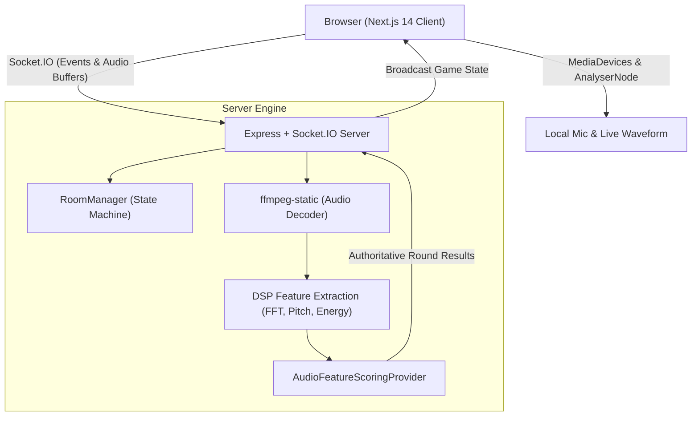

> [!NOTE]
> **[EchoChaos is live!](https://github.com/jojin1709/echochaos-game):** Real-time voice mimicry multiplayer party game powered by Next.js, Socket.IO, Web Audio API, and DSP audio similarity scoring. Developed by **JOJIN JOHN**.

<div align="center">

# 🎙️ EchoChaos
### Hear it. Mimic it. Laugh together.

A browser-based, zero-account voice mimicry party game for 2–8 players. One person creates a party, everyone joins with a 6-character room code, and each round the group listens to a sound prompt, mimics it into their microphone, and gets a real similarity score based on real audio DSP analysis — not a random number.

**Developed with ❤️ by [JOJIN JOHN](https://github.com/jojin1709)**

<br/>

[](https://github.com/jojin1709/echochaos-game)
[](LICENSE)
[](https://nextjs.org/)
[](https://socket.io/)
[](https://www.typescriptlang.org/)
[](https://tailwindcss.com/)

<p><strong>Quick Launch EchoChaos</strong></p>

```bash
npm run dev
```

<sub>Launches both the Socket.IO authoritative game server and Next.js frontend concurrently.</sub>

---

<a href="https://github.com/jojin1709/echochaos-game"></a>&nbsp;&nbsp;&nbsp;&nbsp;&nbsp;&nbsp;<a href="https://github.com/jojin1709"></a>

---

</div>

> [!TIP]
> **Zero friction party play:** No logins, no passwords, no email confirmations. Enter a nickname, share a room code with your friends, and start playing right in your browser!

---

## Table of Contents

- [Table of Contents](#table-of-contents)
- [What is EchoChaos?](#what-is-echochaos)
  - [Why EchoChaos Exists](#why-echochaos-exists)
  - [Why "EchoChaos"?](#why-echochaos)
  - [Audio Scoring, Honestly Explained](#audio-scoring-honestly-explained)
- [EchoChaos in Action](#echochaos-in-action)
- [Quick Start](#quick-start)
  - [Prerequisites](#prerequisites)
  - [Run EchoChaos Locally](#run-echochaos-locally)
- [Key Capabilities](#key-capabilities)
- [Architecture](#architecture)
- [Deployment Guide](#deployment-guide)
  - [Frontend Deployment (Vercel)](#frontend-deployment-vercel)
  - [Backend Deployment (Render)](#backend-deployment-render)
- [Repository Structure](#repository-structure)
- [Environment Variables](#environment-variables)
- [Safety, Privacy, and Audio Guidelines](#safety-privacy-and-audio-guidelines)
- [License](#license)
- [Code of Conduct](#code-of-conduct)
- [About the Developer](#about-the-developer)
- [Community and Support](#community-and-support)
- [Common Questions](#common-questions)

---

## What is EchoChaos?

**EchoChaos** is an interactive, browser-based party game designed for friends, families, and remote groups. Designed and developed by **[JOJIN JOHN](https://github.com/jojin1709)**, it transforms spontaneous vocal impressions into competitive, laugh-out-loud entertainment.

Players gather in a shared real-time lobby, listen to reference sound effects (ranging from roaring dinosaurs and screeching tires to quirky cartoon zaps), record their best vocal impressions, and have their attempts evaluated by a backend DSP (Digital Signal Processing) pipeline.

<a id="why-echochaos-exists"></a>
<details>
<summary><strong>Why EchoChaos Exists</strong></summary>

Most online party games rely either on trivia or text prompts. Voice games are rare, and the few that exist usually rely on arbitrary voting where the funniest friend always wins regardless of skill.

EchoChaos bridges that gap: it gives your party an impartial, algorithmic judge powered by real signal processing features (frequency, pitch, envelope, spectral centroid), while preserving the chaotic fun of hearing your friends try to sound like a microwave or a velociraptor.

</details>

<a id="why-echochaos"></a>
<details>
<summary><strong>Why "EchoChaos"?</strong></summary>

"Echo" because every round challenges players to mimic and reflect audio waveforms back to the room.
"Chaos" because vocal mimicry under time pressure inevitably produces unexpected squeaks, pitch disasters, and room-wide laughter.

</details>

<a id="audio-scoring-honestly-explained"></a>
<details>
<summary><strong>Audio Scoring, Honestly Explained</strong></summary>

EchoChaos does **not** roll random dice. Scoring is server-authoritative and computes real mathematical comparisons:

1. **RMS Energy & Envelope**: Measures timing, silence detection, attack, and decay profile matching.
2. **Spectral Centroid & Bandwidth**: Measures vocal brightness, timbre, and frequency distribution via Fast Fourier Transform (FFT).
3. **Zero-Crossing Rate (ZCR)**: Differentiates between voiced and unvoiced sounds (e.g. hissing vs humming).
4. **Autocorrelation Pitch Estimation**: Compares fundamental pitch contours across normalized frames.
5. **Weighted Similarity Score (0–100)**: Combines these metrics into a balanced score with baseline adjustments so low-end microphones remain competitive.

</details>

---

## EchoChaos in Action

| Stage | Overview |
| :--- | :--- |
| **Lobby & Setup** | Host configures round count, timer, difficulty, and special chaos events. Room code generation with one-click copy. |
| **Sound Challenge** | Reference audio plays for all players simultaneously with visual prompt cues. |
| **Live Mic Recording** | High-performance Web Audio API `AnalyserNode` drives real-time audio visualizers. |
| **Scoring & Leaderboard** | Detailed breakdown across similarity, timing, frequency, and energy with confetti and podium animations. |

---

## Quick Start

### Prerequisites

- **Node.js 18+** or **20+** installed
- **npm** or **pnpm**
- A working microphone and browser supporting the Web Audio API (Chrome, Edge, Firefox, Safari)

### Run EchoChaos Locally

```bash
# 1. Clone the repository
git clone https://github.com/jojin1709/echochaos-game.git
cd echochaos-game

# 2. Install dependencies for all workspaces
npm install
npm run install:all

# 3. Launch both backend and frontend concurrently
npm run dev
```

- Open **[http://localhost:3000](http://localhost:3000)** in your browser.
- Open a second tab or incognito window to simulate Player 2!
- Backend health endpoint is live at **[http://localhost:4000/health](http://localhost:4000/health)**.

---

## Key Capabilities

- **Zero-Account Setup**: Instant frictionless entry — pick a nickname and jump in.
- **Real-Time Multiplayer**: Low-latency Socket.IO room synchronization supporting 2 to 8 players.
- **Authoritative Server Engine**: Prevents client tampering; audio is uploaded, decoded via `ffmpeg-static`, and analyzed strictly on the backend.
- **70+ Sound Challenges**: Extensive catalog spanning 7 categories (Animals, Vehicles, Tech, Household, Monsters, Cartoons, Human).
- **Chaos Round Modifiers**: Random modifiers like *Double Points*, *Tiny Voice*, *Speed Round*, *Reverse Mimic*, and *One Shot*.
- **Visual Personality**: Original fluid SVG character blobs with animated emotional reactions (idle, excited, listening, cheering).
- **Responsive Stage UI**: Glassmorphic dark aesthetic built with Tailwind CSS, custom animations, and mobile-friendly touch targets.

---

## Architecture

EchoChaos uses a decoupled client-server architecture with an authoritative state machine:



---

## Deployment Guide

EchoChaos is pre-configured for free-tier cloud deployment:

### Backend Deployment ([Render](https://render.com))
1. Create a new **Web Service** on Render and connect your GitHub repository (`jojin1709/echochaos-game`).
2. Use the included `render.yaml` Blueprint or configure:
   - **Root Directory**: `server`
   - **Build Command**: `npm install && npm run build`
   - **Start Command**: `npm start`
   - **Health Check Path**: `/health`
3. Set Environment Variable:
   - `CORS_ORIGIN`: Your deployed Vercel URL (e.g. `https://your-echochaos.vercel.app`)

### Frontend Deployment ([Vercel](https://vercel.com))
1. Import your GitHub repository into Vercel.
2. Set **Root Directory** to `frontend`.
3. Framework preset: **Next.js** (configured in `frontend/vercel.json`).
4. Set Environment Variable:
   - `NEXT_PUBLIC_SOCKET_URL`: Your deployed Render backend URL (e.g. `https://echochaos-server.onrender.com`).
5. Click **Deploy**.

---

## Repository Structure

```
echochaos-game/
├── frontend/               # Next.js 14 App Router client
│   ├── app/                # Page routes and layout
│   ├── components/         # Shared UI, ChunkyButtons, Character SVG blobs
│   ├── game/               # Interactive game screens (Lobby, RoundFlow, Results)
│   ├── hooks/              # useGameSocket and useMicRecorder
│   └── lib/                # Socket.IO client singleton
├── server/                 # Node.js + Express authoritative server
│   ├── src/
│   │   ├── audio/          # DSP feature extraction & ffmpeg decoders
│   │   ├── game/           # Room state machine & challenge catalogue
│   │   ├── rooms/          # RoomManager and session lifecycles
│   │   └── socket/         # Socket.IO event handlers
├── shared/                 # Shared TypeScript contracts, events & types
├── database/               # Optional Supabase schema & seed files
├── render.yaml             # Render Blueprint specification
├── CODE_OF_CONDUCT.md      # Contributor Covenant Code of Conduct
├── CONTRIBUTING.md          # Contribution guidelines
└── LICENSE                 # MIT License
```

---

## Environment Variables

### Frontend (`frontend/.env.local`)
```env
NEXT_PUBLIC_SOCKET_URL=http://localhost:4000
```

### Backend (`server/.env`)
```env
PORT=4000
CORS_ORIGIN=http://localhost:3000
```

---

## Safety, Privacy, and Audio Guidelines

- **Microphone Permissions**: The microphone stream is only opened when you explicitly enter the recording phase.
- **Audio Privacy**: Audio clips are streamed solely to evaluate the mimicry attempt in memory for scoring and are immediately cleaned up. No voice data is harvested or sold.
- **Safe Party Atmosphere**: EchoChaos promotes respectful, fun, and inclusive group play.

---

## License

This project is open-source and licensed under the **MIT License**. See the [LICENSE](LICENSE) file for full details.

Copyright (c) 2026 **JOJIN JOHN**.

---

## Code of Conduct

EchoChaos adheres to the Contributor Covenant Code of Conduct. Please review [CODE_OF_CONDUCT.md](CODE_OF_CONDUCT.md) for community standards and expectations.

---

## About the Developer

**JOJIN JOHN** is a full-stack engineer and cybersecurity enthusiast passionate about real-time interactive web applications, audio engineering, and creative computing.

- **GitHub**: [@jojin1709](https://github.com/jojin1709)
- **Repository**: [jojin1709/echochaos-game](https://github.com/jojin1709/echochaos-game)

---

## Community and Support

- 🐛 **Found a bug?** Open an issue on the [Issue Tracker](https://github.com/jojin1709/echochaos-game/issues).
- 💡 **Have a feature idea?** Start a discussion on [GitHub Discussions](https://github.com/jojin1709/echochaos-game/discussions).
- 🌟 **Like the project?** Don't forget to star the repository!

---

## Common Questions

<details>
<summary><strong>Do players need to create an account?</strong></summary>
No. EchoChaos is 100% account-free. Just type in your name and start playing immediately.
</details>

<details>
<summary><strong>How many people can play together?</strong></summary>
A room supports between 2 and 8 players for optimal fun and pacing.
</details>

<details>
<summary><strong>Does it work on mobile browsers?</strong></summary>
Yes! The interface is fully responsive, and modern mobile browsers supporting Web Audio recording can join and play seamlessly.
</details>

<details>
<summary><strong>Is the scoring fake?</strong></summary>
No. The audio is decoded into raw PCM and evaluated across pitch contours, envelope shape, energy, and frequency spectrums using actual DSP algorithms.
</details>

---

<div align="center">
  <sub>Built with ❤️ by <strong>JOJIN JOHN</strong></sub>
</div>
